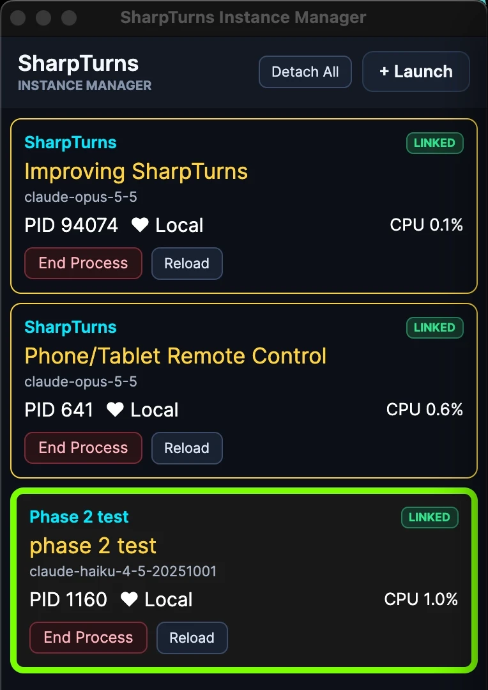

# SharpTurns

Website: <https://sharpturns.ai/>

A lightweight desktop app (.NET 10, Avalonia) that gives your installed Claude
Code CLI a rendered-Markdown conversation UI, with projects, conversations, and
context management.

The name has two halves:

- **Sharp** is for C#, for how sharp a rendered Markdown conversation looks
  next to the CLI's terminal output, and for the sharper reasoning a model
  shows when its context is kept clean.
- **Turns** is for conversation turns, the unit the whole app is built around.

SharpTurns is an independent project. It is not affiliated with or endorsed by
Anthropic.


## Why context management matters

In a plain CLI session, everything a turn does stays in the context for the
rest of the conversation: every file it read, every build log, every search
result. Long sessions fill the context window with output the model no longer
needs, and every request carries all of it. When the window is full,
auto-compact summarizes the whole conversation at once, on its own schedule.

SharpTurns turns auto-compact off and lets you decide what the model sees, one
turn at a time:

- **Compress** a finished turn. Only the work in between is summarized: the
  tool calls, their output, and the intermediate steps become a generated work
  summary. Your messages and answers and the model's final response are never
  summarized; they are replayed word for word, so the two most important parts
  of every turn stay fully intact. Each compressed turn shows how much smaller
  its replay became, and a compression is kept only if it makes the replay
  smaller.
- **Auto-Summarize**, on for new conversations, compresses each turn as soon as
  it finishes, so a conversation stays lean without any effort from you.
- **Hide** a dead end or a turn that no longer matters, and it leaves the
  replay entirely.
- **Choose which images** keep being replayed, instead of resending them all.
- **Branch** a useful run of turns into a fresh conversation.


**Less noise, more signal.** Once a turn is done, most of its raw tool output
is noise: whole files read for one function, pages of build and test logs,
searches that found nothing, attempts that were abandoned. Left in the
context, all of that bloat stresses the model's attention: every token
competes with the ones that matter, and the decision or fact the model needs
becomes a needle in an ever-larger haystack. Auto-Summarize removes the noise
without touching the signal: each finished turn is replayed as your own
messages and answers, word for word, a summary of what was done and decided,
and the final response, word for word. Only the work effort is condensed;
what you asked and what the model concluded reach every later turn exactly as
they were written. Every later turn starts from that distilled history instead
of the raw transcript, so the context holds a much higher share of useful
information, and the gain grows with every turn.

Nothing is thrown away. The full turn stays in the database, View Full Turn
Content shows it, and Expand or Show puts it back in the replay. Each change
starts the next turn in a fresh CLI session, seeded from the trimmed history.

**A fresh session doesn't mean a cold cache.** A lot of work went into keeping
the reseeded history eligible for the API's input token cache:

- The history is replayed the same way every time, so earlier turns stay
  unchanged from one request to the next, and a single cache marker with a
  1-hour lifetime sits at the end of the history.
- The CLI's Git status snapshot, which changes with the repository and would
  invalidate the cached history after it, is turned off.
- The CLI's experimental betas are turned off, because they use all four of
  the API's cache markers and leave none for the history.

So when you compress the latest turn, the next turn can read every earlier
turn from the cache. Only the changed turn and the new request are sent
uncached. Hiding or compressing an older turn changes the history from that
turn on, so that part is cached again. Each turn card's **First-Request Cache
Hits** shows how much of the turn's opening request came from the cache.

**One conversation instead of a crowd of subagents.** Subagents exist mainly
to protect a context window that never shrinks: each one reads and searches
in a context of its own and hands back only a summary, so the main
conversation doesn't fill up. That protection is expensive. [Anthropic
found][multi-agent] that its multi-agent research system used about 15 times
the tokens of a chat, against about 4 times for a single agent, and that most
coding tasks split into far fewer truly parallel pieces than research does.
Each subagent starts cold and rereads the files it needs, parallel subagents
can duplicate each other's work, and each acts on assumptions the others never
see. [Cognition argues][cognition] that these conflicting decisions are what
make multi-agent results unreliable, and the main conversation is left to
reconcile them. With every finished turn condensed, SharpTurns' main
conversation doesn't need that protection: one model keeps the whole thread of
decisions and can take on far more work before its context fills up.
SharpTurns blocks the CLI's subagent tools, so all of the work happens in the
one conversation you can see and manage. Each turn still has to fit in the
context window on its own, so split very large jobs across several turns.

If you want subagents anyway, the change is small. In
`src/SharpTurns.ClaudeCli/ClaudeCliCodingPolicy.cs`, add `Agent` to
`CommonTools`, remove `Agent`, `Task`, and `Workflow` from `DeniedTools`, and
delete the system prompt line that says subagents are disabled. SharpTurns
isn't tested with subagents, and it shows only the main conversation, so their
tool calls and token use won't appear in its tool cards or context figures.

[multi-agent]: https://www.anthropic.com/engineering/multi-agent-research-system
[cognition]: https://cognition.ai/blog/dont-build-multi-agents

The result is conversations that can run far longer, a model that stays
focused on what matters, and fewer tokens sent with every request.

## Features

- **Context management**, described above: compress turns into work summaries
  (by hand or automatically), hide them from the replay, choose which images
  are replayed, and clean up or delete turns in bulk.
- **Projects and conversations**, stored in a local SQLite database. A
  conversation can move to another project, run in its own workspace folder,
  be protected from deletion, and start the MCP servers you select for it.
- **Streaming turns** rendered as Markdown, with a collapsible card for each
  tool call, dialogs for the CLI's questions and permission checks, messages
  queued during a turn, and image attachments.
- **Usage**: per-turn token and cache metrics, and your subscription's
  remaining 5-hour and weekly limits as the CLI reports them.
- **Branching**: copy a run of turns into a new conversation.
- **Extras**: notes, search, user message history, Markdown and DOCX export,
  and a separate Markdown Viewer.
- **Dictation** with your own Deepgram API key (optional).
- **Several instances at once**, with an optional Instance Manager that docks
  them beside it and launches, reloads, and ends them.

## How it uses the CLI

SharpTurns has no model provider, API client, or tool runtime of its own. Each
turn runs your installed, unmodified `claude` binary as `claude -p` with
stream-json input and output, and the CLI runs its own tools under its own
sign-in. SharpTurns never reads or stores your Claude credentials. Turns count
against your Claude plan or API usage as usual.

Before you use it, know that:

- **Coding tools run without asking.** Read, Glob, Grep, Edit, Write,
  NotebookEdit, Bash, WebFetch, and WebSearch (plus PowerShell on Windows) are
  preapproved. Turns start in the project's folder, or the conversation's own
  workspace, but the tools aren't confined to it. The CLI's own safety checks
  still open an Allow/Deny dialog, and so do commands matching the ask rules in
  Config → Preferences, `git commit` and `git push` by default. Subagents and
  the `pkill` and `killall` commands are denied.
- **MCP servers run only where you select them.** Define servers in Config →
  MCP Servers, then select them for a conversation in Edit Conversation. The
  CLI starts them with each of its turns, and their tools run without asking.
  Your own CLI MCP configuration isn't used.
- **Context files go with fresh sessions.** Files you add in Edit Conversation
  are read before each turn and sent to Claude whenever a new CLI session
  starts. Changing one starts a new session on the next turn.
- **Your CLI setup still applies.** The CLI discovers the project's `CLAUDE.md`
  (or `AGENTS.md`) and loads your settings files. SharpTurns overrides them to
  turn off hooks, auto-compact, and the fallback model.
- **SharpTurns manages the context.** When a CLI session can't be resumed, or
  after you hide or compress turns, the next turn starts a fresh session seeded
  from the saved conversation. Work summaries come from separate tool-less
  `claude -p` calls.

[docs/DESIGN.md](docs/DESIGN.md) explains the reasons behind these choices.

## Requirements

- The [.NET 10 SDK](https://dotnet.microsoft.com/download/dotnet/10.0)
  (10.0.300 or a later feature band).
- Claude Code CLI **2.1.286 or later**, installed and signed in. Run `claude`
  once in a terminal to sign in. SharpTurns checks the version at startup and
  shows an error if it's missing or older.
- Optional, for dictation: a [Deepgram](https://deepgram.com/) API key and a
  command-line recorder: `ffmpeg` on macOS and Windows, or `pw-record` or
  `arecord` on Linux.

By default SharpTurns runs `claude` from your `PATH`. To use another install,
enter the full path to the executable in **Config → Preferences**. On Windows,
it must be the native `claude.exe`, not a `.cmd` or shell wrapper.

SharpTurns is developed and tested mainly on macOS. It also targets Windows and
Linux. System sounds are available on macOS and Windows.

## Build and run

There are no prebuilt binaries. Clone the repository, then let your CLI set it
up (recommended) or build it yourself.

### Let your CLI set it up (recommended)

The best way to get running is to have the Claude Code CLI you already use do
the setup. Start `claude` in the repository folder with a capable model such as
Opus 5.5 (`claude --model claude-opus-5-5`), and ask something like:

> Check that this machine has what SharpTurns needs, install anything missing,
> then build it, run the tests, and start the app. After I close it, update its
> model list from Anthropic's models overview page.

The CLI reads the repository's `AGENTS.md` (through `CLAUDE.md`), so it knows
how the project is laid out, how to build and test it, and how to update the
model list. It can also install a recorder for dictation and work through
platform-specific problems.

**Why the model list step matters:** SharpTurns starts with a fixed list of
model IDs, and new models come out after each release. The CLI compares that
list with Anthropic's [models overview][models] and brings it up to date, so
the models you can pick are the current ones. Ask it again whenever new models
come out, with every SharpTurns window closed. You can also edit the list
yourself in **Config → Models**.

### Build it yourself

From the repository root:

```sh
./run.sh                # macOS and Linux
./run.sh -c Release     # an optimized build
dotnet run --project src/SharpTurns.App   # any platform, including Windows
```

To run the tests:

```sh
dotnet test
```

The starting model list may be out of date. Check it against Anthropic's
[models overview][models] in **Config → Models**.

[models]: https://platform.claude.com/docs/en/about-claude/models/overview

## Your data

- Everything is stored in one SQLite database, `sharpturns.db`, in a
  `SharpTurns` folder under your local app-data directory:
  `~/Library/Application Support` on macOS, `%LOCALAPPDATA%` on Windows, and
  `~/.local/share` on Linux. This includes your conversations, the images you
  attach, and your settings. A `locks` folder beside it holds a small file for
  each conversation you've opened, which keeps two instances out of the same
  conversation.
- **The Deepgram API key is stored in plain text** in that database. Anyone who
  can read the file can read the key.
- Turns go through the CLI. SharpTurns itself only connects to the network to
  send a dictation recording to Deepgram, to load images that rendered Markdown
  links to, and to fetch a remote file you open in the Markdown Viewer.

## Dictation

Click **Voice** in the composer (or press Ctrl+1 / ⌘+1 in the message box) to
start recording, then **Stop** to transcribe. The transcript goes in at the
cursor, and **Undo** removes it. Save your Deepgram key in
**Config → API Keys** first. On macOS, the first recording may ask for
microphone permission for the app you launched SharpTurns from.

Two environment variables override the recorder:

- `SHARPTURNS_AUDIO_RECORDER_PATH`: the recorder executable.
- `SHARPTURNS_AUDIO_INPUT_DEVICE`: the input device to record from.

## Several instances and the Instance Manager

You can run several SharpTurns instances at once, for example one per
conversation. A conversation is open in one instance at a time. Another
instance that selects it waits, and opens it as soon as the first switches to a
different conversation or closes. A conversation with a turn or summary still
running stays with its instance until that finishes.

The optional **SharpTurns Instance Manager** keeps track of them. Start it from
the repository root:

```sh
./run-instance-manager.sh                                  # macOS and Linux
dotnet run --project src/SharpTurns.InstanceManager.App    # any platform
```



- **Cards:** each running instance has one, showing its project, conversation,
  model, process ID, and CPU use. Drag a card to reorder the list.
- **Docking:** the manager links every instance it finds. A linked window's
  left edge sits on the manager's right edge, and moving or vertically resizing
  either one moves or resizes the other, so they stay the same height. Clicking
  a card brings its instance to the front. **Detach All** puts the windows back
  where they were.
- **+ Launch** starts another instance from this repository with `dotnet run`.
- **Reload** restarts an instance and reopens its project and conversation, so
  it picks up changes to the source. **End Process** ends it. Both are disabled
  while a turn or summary is running in it, and an unsent draft is lost.

On macOS and Linux, Launch and Reload build the app first. On Windows they run
the existing build, since running instances lock its files, so build it before
reloading.

## About the author

I've been a developer for forty years. For more than half of them I've had my
eyes glued to a terminal, writing C++, Python, Java and plenty more, or doing
Linux admin work, all in vim. Eventually the terminal stopped being fun. The
Claude Code CLI works well, but it isn't something I enjoy looking at all day.

Soon after I got serious about agentic coding, I noticed that many of the
problems I ran into came from the context: too much noise, too little signal.
So I set out to see how coherently a model can reason when its context is kept
clean, turn after turn. SharpTurns is my answer: far better than when every
turn replays the same noise and bloat.

SharpTurns is a small piece of a much larger agentic development platform I've
built for my own work. Unlike SharpTurns, which runs on the Claude Code CLI,
that platform is completely provider and model agnostic. SharpTurns keeps two
of its biggest advantages: beautiful Markdown rendering and continuous context
optimization.

Apart from changing a few color hex values, I haven't written a single line of
SharpTurns' code, and I'm very happy about that. Porting it out of the larger
platform into this standalone app took less than two days, and the porting
itself was done from inside that platform. It shows what's possible in 2026
with today's excellent models and harnesses.

If you're interested in custom work, you can reach me at
[jerry@sharpturns.ai](mailto:jerry@sharpturns.ai).

## License

MIT; see [LICENSE](LICENSE). Third-party components and their licenses are
listed in [THIRD-PARTY-NOTICES.md](THIRD-PARTY-NOTICES.md).
